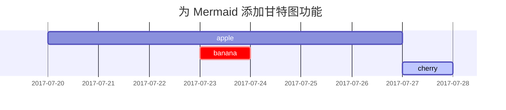

## 标题

<!-- markdownlint-capture -->
<!-- markdownlint-disable -->
# H1 — 一级标题
{: .mt-4 .mb-0 }

## H2 — 二级标题
{: data-toc-skip='' .mt-4 .mb-0 }

### H3 — 三级标题
{: data-toc-skip='' .mt-4 .mb-0 }

#### H4 — 四级标题
{: data-toc-skip='' .mt-4 }
<!-- markdownlint-restore -->

## 段落

Quisque egestas convallis ipsum, ut sollicitudin risus tincidunt a. Maecenas interdum malesuada egestas. Duis consectetur porta risus, sit amet vulputate urna facilisis ac. Phasellus semper dui non purus ultrices sodales. Aliquam ante lorem, ornare a feugiat ac, finibus nec mauris. Vivamus ut tristique nisi. Sed vel leo vulputate, efficitur risus non, posuere mi. Nullam tincidunt bibendum rutrum. Proin commodo ornare sapien. Vivamus interdum diam sed sapien blandit, sit amet aliquam risus mattis. Nullam arcu turpis, mollis quis laoreet at, placerat id nibh. Suspendisse venenatis eros eros.

## 列表

### 有序列表

1. 第一项
2. 第二项
3. 第三项

### 无序列表

- 章节
  - 小节
    - 段落

### 待办事项列表

- [ ] 任务
  - [x] 步骤 1
  - [x] 步骤 2
  - [ ] 步骤 3

### 描述列表

太阳  
: 地球围绕其公转的恒星

月亮  
: 地球的天然卫星，通过反射太阳光而可见

## 引用块

> 这一行展示了 _引用块_。

## 提示框

<!-- markdownlint-capture -->
<!-- markdownlint-disable -->
> 这是一个 `tip` 类型提示框的示例。
{: .prompt-tip }

> 这是一个 `info` 类型提示框的示例。
{: .prompt-info }

> 这是一个 `warning` 类型提示框的示例。
{: .prompt-warning }

> 这是一个 `danger` 类型提示框的示例。
{: .prompt-danger }
<!-- markdownlint-restore -->

## 表格

| 公司名称                     | 联系人           | 国家    |
| :--------------------------- | :--------------- | ------: |
| Alfreds Futterkiste          | Maria Anders     | 德国    |
| Island Trading               | Helen Bennett    |      英国 |
| Magazzini Alimentari Riuniti | Giovanni Rovelli |   意大利 |

## 链接

<http://127.0.0.1:4000>

## 脚注

点击钩子将跳转到脚注[^footnote]，这里是另一个脚注[^fn-nth-2]。

## 行内代码

这是一个 `行内代码` 的示例。

## 文件路径

这是文件路径：`/path/to/the/file.extend`{: .filepath}。

## 代码块

### 通用代码块

```text
这是一个通用代码片段，没有语法高亮和行号。
```

### 指定语言

```bash
if [ $? -ne 0 ]; then
  echo "命令执行失败。";
  #执行必要操作 / 退出
fi;
```

### 指定文件名

```sass
@import
  "colors/light-typography",
  "colors/dark-typography";
```
{: file='_sass/jekyll-theme-chirpy.scss'}

## 数学公式

由 [**MathJax**](https://www.mathjax.org/) 驱动的数学公式：

$$
\begin{equation}
  \sum_{n=1}^\infty \frac{1}{n^2} = \frac{\pi^2}{6}
  \label{eq:series}
\end{equation}
$$

我们可以引用该公式为 \eqref{eq:series}。

当 $a \ne 0$ 时，方程 $ax^2 + bx + c = 0$ 有两个解，分别为：

$$ x = \frac{-b \pm \sqrt{b^2 - 4ac}}{2a} $$

## Mermaid SVG 图表



## 图片

### 默认（带标题）

{: width="972" height="589" }  
_全屏宽度并居中对齐_

### 左对齐

{: width="972" height="589" .w-75 .normal}

### 左浮动

{: width="972" height="589" .w-50 .left}  
Praesent maximus aliquam sapien. Sed vel neque in dolor pulvinar auctor. Maecenas pharetra, sem sit amet interdum posuere, tellus lacus eleifend magna, ac lobortis felis ipsum id sapien. Proin ornare rutrum metus, ac convallis diam volutpat sit amet. Phasellus volutpat, elit sit amet tincidunt mollis, felis mi scelerisque mauris, ut facilisis leo magna accumsan sapien. In rutrum vehicula nisl eget tempor. Nullam maximus ullamcorper libero non maximus. Integer ultricies velit id convallis varius. Praesent eu nisl eu urna finibus ultrices id nec ex. Mauris ac mattis quam. Fusce aliquam est nec sapien bibendum, vitae malesuada ligula condimentum.

### 右浮动

{: width="972" height="589" .w-50 .right}  
Praesent maximus aliquam sapien. Sed vel neque in dolor pulvinar auctor. Maecenas pharetra, sem sit amet interdum posuere, tellus lacus eleifend magna, ac lobortis felis ipsum id sapien. Proin ornare rutrum metus, ac convallis diam volutpat sit amet. Phasellus volutpat, elit sit amet tincidunt mollis, felis mi scelerisque mauris, ut facilisis leo magna accumsan sapien. In rutrum vehicula nisl eget tempor. Nullam maximus ullamcorper libero non maximus. Integer ultricies velit id convallis varius. Praesent eu nisl eu urna finibus ultrices id nec ex. Mauris ac mattis quam. Fusce aliquam est nec sapien bibendum, vitae malesuada ligula condimentum.

### 深色/浅色模式与阴影

下方图片会根据主题偏好自动切换深色/浅色模式，请注意它带有阴影效果。

{: .light .w-75 .shadow .rounded-10 w='1212' h='668' }  
{: .dark .w-75 .shadow .rounded-10 w='1212' h='668' }

## 视频



## 脚注来源

[^footnote]: 脚注内容  
[^fn-nth-2]: 第二个脚注内容
